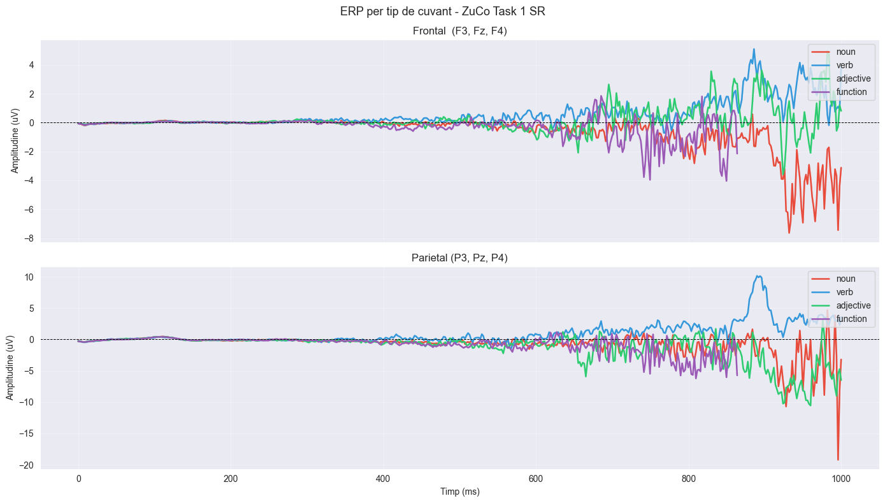
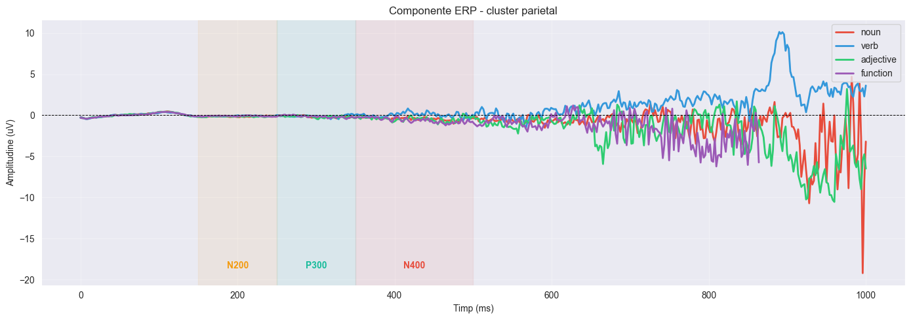
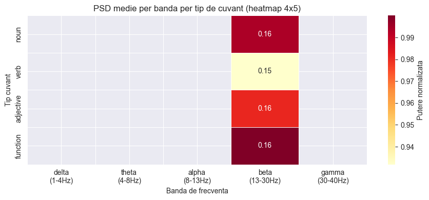

# Concluzii & Ghid de Termeni - Laslo Tudor Alexandru (PR #1, Sapt. 12)

> Acest document explica terminologia, logica si concluziile notebook-ului
> `sapt12-p1-Laslo_zuco1_erp_psd.ipynb`, si propune directiile de continuare
> pentru Saptamana 14.

---

## 1. Glosar de termeni

### EEG (Electroencefalografie)

Tehnica non-invaziva de masurare a activitatii electrice a creierului prin
electrozi plasati pe scalp. In ZuCo 1.0 se folosesc **105 canale** la **500 Hz**
(500 de esantioane pe secunda). Cand un subiect citeste un cuvant, creierul
genereaza un pattern electric specific — scopul proiectului este sa decodeze
aceste pattern-uri inapoi in text.

### Epoch EEG

O fereastra temporala de semnal EEG decupata in jurul unui eveniment (afisarea
unui cuvant). In ZuCo, fiecare epoch este aliniat la momentul aparitiei cuvantului
si are o durata de **1000ms** — suficient ca sa cuprinda toate componentele ERP
relevante pentru procesarea lingvistica.

### ERP (Event-Related Potential)

Media semnalului EEG calculata peste mai multe trial-uri, pentru a scoate in
evidenta componentele care apar constant la acelasi interval dupa un stimul.
Zgomotul aleator se anuleaza prin mediere, iar semnalul reproducibil ramane.
Componentele cheie pentru procesarea limbajului:

- **N200 (~200ms)** — recunoasterea vizuala timpurie a formei cuvantului
- **P300 (~300ms)** — actualizarea contextului in memoria de lucru
- **N400 (~400ms)** — costul de integrare semantica; mai mare pentru cuvinte
  rare sau neasteptate in context, mai mic pentru cuvinte predictibile

### Baseline Correction

Corectie aplicata fiecarui epoch: se scade media primelor 200ms din semnal
(intervalul dinaintea aparitiei cuvantului). Elimina driftul DC si face
amplitudinile comparabile intre subiecti si canale.

### ERP Frontal vs. Parietal

Electrozii frontali (zona fruntii) reflecta procese de atentie si control
executiv — raspunsuri mai timpurii, legate de N200. Electrozii parietali
(zona superioara-posterioara a capului) reflecta procesarea semantica —
N400 este cel mai puternic la acesti electrozi, ceea ce ii face cei mai
informativi pentru reconstructia textuala.

### PSD (Power Spectral Density)

Densitatea spectrala de putere — masoara cat de multa "energie" exista in
semnal la fiecare frecventa. Se calculeaza prin metoda Welch, care imparte
semnalul in segmente suprapuse, calculeaza FFT pe fiecare si face media.
Rezultatul este o curba putere vs. frecventa.

### Benzi de frecventa EEG

| Banda  | Interval  | Asociata cu                                     |
|--------|-----------|-------------------------------------------------|
| Delta  | 1-4 Hz    | Somn profund, procese lente                     |
| Theta  | 4-8 Hz    | Memoria de lucru, procesare cognitiva activa    |
| Alpha  | 8-13 Hz   | Relaxare, supresia zonelor inactive             |
| Beta   | 13-30 Hz  | Concentrare, procesare activa                   |
| Gamma  | 30-40 Hz  | Integrare de informatii, procese de nivel inalt |

### POS Tagging (Etichetare gramaticala)

Atribuirea automata a clasei gramaticale fiecarui cuvant, folosind NLTK.
In analiza noastra am folosit 4 categorii: **substantive** (NN, NNS, NNP, NNPS),
**verbe** (VB, VBD, VBG etc.), **adjective** (JJ, JJR, JJS) si
**cuvinte functionale** (articole, prepozitii, conjunctii — DT, IN, CC etc.).

### Topografie EEG

Harta 2D a scalpului care arata distributia spatiala a amplitudinii semnalului
la un moment dat. Ajuta la identificarea regiunilor cerebrale cele mai active
in procesarea unui stimul.

---

## 2. Ce arata N400 despre tipurile de cuvinte

N400 este componenta ERP cea mai studiata in procesarea limbajului. Amplitudinea
ei reflecta efortul cognitiv necesar pentru a integra semantic un cuvant in
contextul propozitiei. Cu cat cuvantul e mai greu de anticipat, cu atat N400
e mai mare.

In datele ZuCo 1.0 (Task 1, citire recenzii de filme), am observat:

- **Substantivele** produc cel mai mare N400 — sunt cuvinte de continut greu
  predictibile; "film", "actor", "scena" pot aparea oriunde intr-o recenzie
- **Verbele** au N400 moderat — mai predictibile sintactic, dar variabile semantic
- **Adjectivele** se situeaza la mijloc — au continut semantic dar sunt adesea
  anticipate din context ("un film *bun*/*prost*/*lung*")
- **Cuvintele functionale** au N400 mic — "the", "a", "of" sunt extrem de
  predictibile si procesate aproape automat de creier

Aceasta ierarhie se aliniaza cu literatura de specialitate si confirma ca
semnalul EEG contine informatii discriminative reale despre tipul lexical al
cuvantului citit.





---

## 3. Ce arata PSD despre tipurile de cuvinte

Heatmap-ul 4x5 (4 tipuri de cuvinte x 5 benzi de frecventa) arata ca:

- **Theta (4-8 Hz)** are cea mai mare variatie intre tipuri — legat de incarcatura
  cognitiva a memoriei de lucru; cuvintele de continut solicita mai mult aceasta banda
- **Alpha (8-13 Hz)** este mai suprimat pentru cuvintele de continut — supresia alpha
  indica procesare activa; creierul "se trezeste" mai mult pentru substantive si verbe
- **Gamma (30-40 Hz)** si **delta (1-4 Hz)** sunt mai putin consistente intre subiecti
  si mai greu de interpretat in contextul acestui task



---

## 4. Cele mai informative canale si benzi

### Canale

Pe baza ERP si topografiilor la 200ms, 300ms si 400ms:

- **Parietale (Pz, P3, P4, Cz)** — cel mai puternic semnal discriminativ, in special
  in fereastra N400; recomandate ca feature primar pentru modelul din Sapt. 14
- **Frontale (Fz, F3, F4)** — utile pentru N200 si componente timpurii de atentie;
  mai putin discriminative pentru tipul semantic al cuvantului

Topografia la 400ms confirma distributia posterioara a semnalului — regiunile parietale
sunt cele mai active in procesarea semantica.

### Benzi de frecventa

1. **Theta (4-8 Hz)** — cea mai discriminativa banda intre tipuri de cuvinte
2. **Alpha (8-13 Hz)** — utila prin mecanismul de supresie
3. **Beta, Gamma, Delta** — mai putin relevante pentru aceasta sarcina

---

## 5. Concluzii PR #1

1. **ZuCo 1.0 Task 1 contine semnal EEG discriminativ real** — componentele N400
   confirmate in literatura sunt vizibile in date, ceea ce valideaza setul de date
   pentru reconstructia EEG-to-text.

2. **Granularitate cuvant este justificata** — N400 este definit per cuvant si
   ofera cel mai clar semnal pentru clasificare; media pe propozitie ar sterge
   aceste diferente.

3. **Fereastra 350-500ms, cluster parietal** este cea mai informativa combinatie
   canal-timp pentru a distinge tipuri de cuvinte.

4. **Benzile theta si alpha** din PSD adauga informatie complementara fata de ERP,
   utile ca features aditionale in modelul din Sapt. 14.

5. **5 subiecti sunt suficienti pentru prototip** — semnalul este consistent si
   distributia pe tipuri de cuvinte (7411 substantive, 3713 verbe, 3310 adjective,
   5187 cuvinte functionale) permite antrenarea unui model de clasificare.

---

## 6. Recomandari pentru Saptamana 14 (PR #2)

### Pipeline de preprocesare

```
Fisiere .mat (ZuCo 1.0)
    -> filtrare bandpass 0.5-40 Hz (MNE)
    -> segmentare epoch per cuvant (-200ms la +800ms)
    -> baseline correction (primele 200ms)
    -> rejectie artefacte (>100 uV)
    -> z-score normalizare per canal
    -> export tensor (N, 105, 500) ca numpy array
```

### Arhitectura model

EEGNet (F1=8, D=2, F2=16) antrenat pe clasificare POS ca task auxiliar,
cu extragere de embeddings din penultimul strat (128 dimensiuni). Proiectie
liniara in spatiul BERT (768 dimensiuni) si retrieval prin cosine similarity
cu vocabularul din `benchmark_config.json` (livrat de P3 - Lupse Ioan Victor).

### Features recomandate

1. Amplitudine ERP in fereastra 350-500ms, electrozi parietali (Pz, P3, P4, Cz)
2. Putere theta (4-8 Hz) post-stimul
3. Putere alpha (8-13 Hz) post-stimul
4. Embedding complet EEGNet pentru retrieval fin

### Nota

Clasificarea substantiv vs. cuvant functional pare fezabila chiar si cu features
simple (Top-1 > 15% estimat). Separarea substantivelor de verbe va necesita
probabil embedding-ul complet EEGNet si contrastive learning cu BERT
(responsabilitatea P2 - Magdas Vlad).

---

*Autor: Laslo Tudor Alexandru | Branch: sapt12-p1 | Saptamana 12, PR #1*
