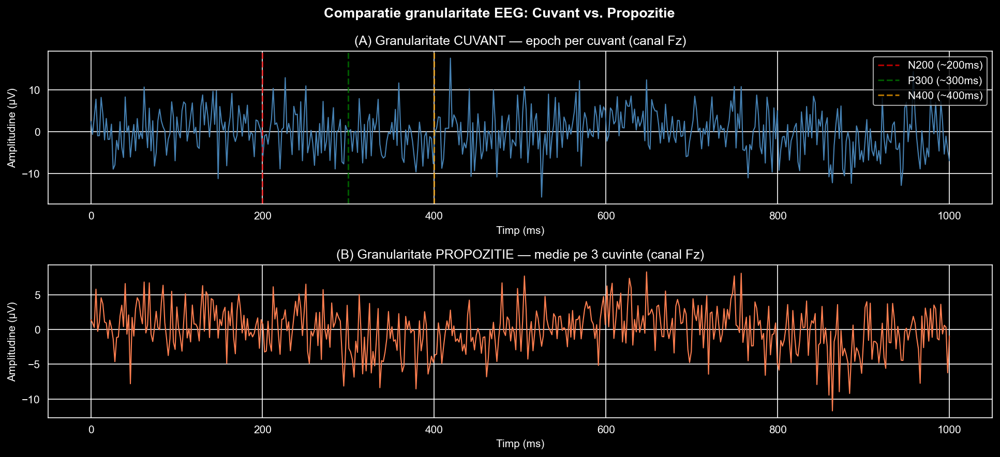
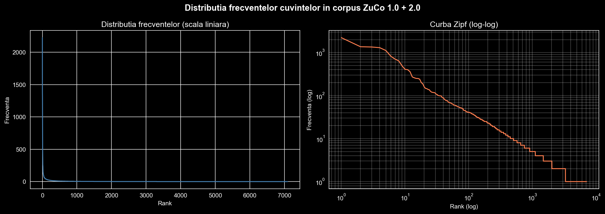
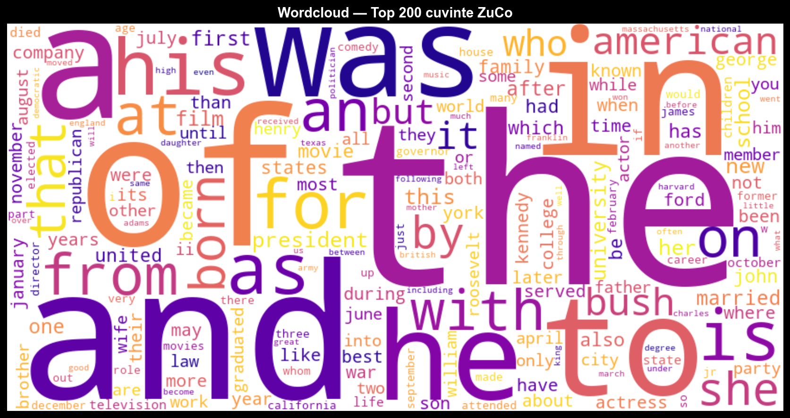
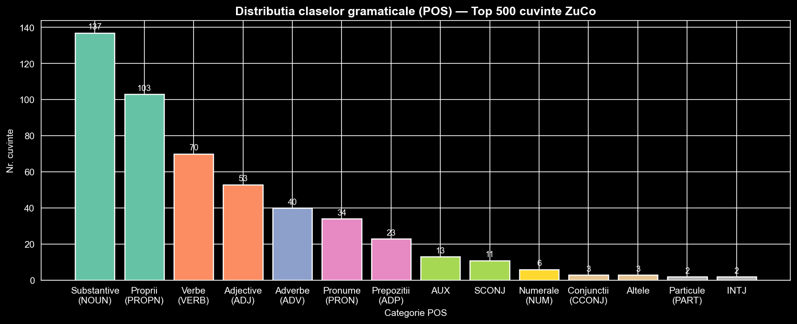
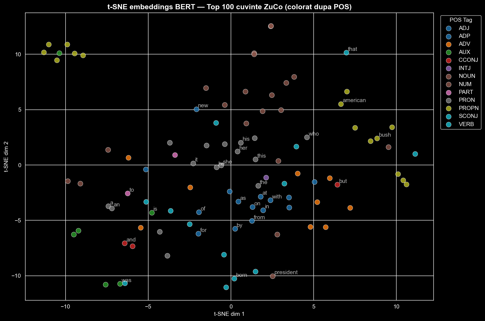

# Concluzii & Ghid de Termeni - Lupse Ioan Victor (PR #1, Sapt. 12)

> Acest document explica terminologia, logica si concluziile notebook-ului `sapt12-lupse_linguistic_analysis.ipynb`, si propune directiile de continuare pentru Saptamana 14.

---

## 1. Glosar de termeni

### EEG (Electroencefalografie)
Tehnica non-invaziva de masurare a activitatii electrice a creierului prin electrozi plasati pe scalp. In ZuCo se folosesc **105 canale** la **500 Hz** (500 esantioane pe secunda). Cand un subiect citeste un cuvant, creierul genereaza un pattern electric specific - scopul proiectului este sa decodeze aceste pattern-uri inapoi in text.

### Epoch EEG
O fereastra temporala de semnal EEG decupata in jurul unui eveniment (prezentarea unui cuvant). In ZuCo, fereastra este **[-200ms, +800ms]** fata de momentul afisarii cuvantului - 200ms inainte (baseline) si 800ms dupa.

### ERP (Event-Related Potential)
Componente predictibile ale semnalului EEG care apar la intervale fixe dupa un stimul:
- **N200 (~200ms)** - procesare vizuala timpurie, recunoasterea formei cuvantului
- **P300 (~300ms)** - actualizarea contextului, detectarea noutatii
- **N400 (~400ms)** - **componenta cheie pentru semantica** - apare mai ampla pentru cuvinte neasteptate contextual ("Am mancat o pizza cu *elefant*") si mai slaba pentru cuvinte predictibile. Definita per cuvant in ZuCo.

### Granularitate EEG
Nivelul la care aliniezi semnalul EEG cu textul:
- **Nivel cuvant** - un epoch per cuvant, mai multe exemple de antrenare, N400 definit clar
- **Nivel propozitie** - media epoch-urilor dintr-o propozitie, semnal mai stabil dar mult mai putine exemple

**Alegere: nivel cuvant** - N400 justifica aceasta decizie teoretic.



### Corpus
Totalitatea textelor folosite pentru analiza. Corpus-ul nostru = ZuCo 1.0 + ZuCo 2.0, dupa deduplicare: **2,132 propozitii, 39,352 tokens, 7,092 cuvinte unice**.

### Token
Un cuvant individual dupa tokenizare (splitting dupa spatii + curatare punctuatie). "Hello, world!" -> ["hello", "world"] - 2 tokens.

### Vocabular
Multimea cuvintelor unice din corpus. Vocabularul complet are 7,092 intrari, dar pentru benchmark alegem top-200 dupa filtrare.

### Stopwords
Cuvinte functionale fara continut semantic propriu ("the", "a", "of", "in"). Sunt excluse din vocabularul de benchmark deoarece semnalul EEG pentru aceste cuvinte este slab si nespecific - creierul le proceseaza automat, fara efort semantic.

---

## 2. Legea lui Zipf

### Ce este
O regularitate universala in limbajul natural: daca ordonezi cuvintele unui text dupa frecventa, frecventa cuvantului de rang *r* este proportionala cu *1/r*. Al doilea cel mai frecvent cuvant apare de ~2x mai rar decat primul, al treilea de ~3x mai rar etc.

### Cum se confirma
Pe **scala log-log**, distributia frecventelor devine o linie dreapta - semnatura matematica a unei legi a puterii. Graficul din notebook confirma ca ZuCo respecta Zipf.



### Implicatia pentru proiect
Un vocabular mic acopera o proportie mare din tokens:

| Vocab | Acoperire corpus |
|-------|-----------------|
| 50    | 40.7%           |
| 200   | 55.0%           |
| 1000  | 74.6%           |

**Concluzie practica:** Un model de clasificare cu 200 de cuvinte va intalni cuvinte pe care stie sa le clasifice in >55% din cazuri - punct de start realist.



---

## 3. POS Tagging (Etichetare gramaticala)

### Ce este
Atribuirea automata a clasei gramaticale fiecarui cuvant folosind modelul spaCy `en_core_web_sm`. Categorii principale: NOUN, VERB, ADJ, ADV, PRON, ADP, PROPN, AUX.

### Rezultate ZuCo
Din top-500 cuvinte: NOUN (137) + PROPN (103) = 240 - aproape jumatate sunt substantive. Explicat de continutul Wikipedia dominant in ZuCo (entitati numite, concepte).

### Clasificare semantica vs. lexicala
| Tip | Clase | Sansa random | Tinta realista | Utilitate |
|-----|-------|-------------|----------------|-----------|
| Semantica (POS) | 10 | 10% | 40-60% | Scazuta - stii categoria, nu cuvantul |
| Lexicala (200 cuvinte) | 200 | 0.5% | Top-1: 10-25%, Top-5: 30-55% | Ridicata - stii cuvantul exact |

**Alegere: clasificare lexicala** - obiectivul final e reconstructia textului, nu etichetarea gramaticala.



---

## 4. BERT si t-SNE

### BERT (bert-base-uncased)
Model de limbaj dezvoltat de Google, antrenat pe miliarde de cuvinte. Transforma un cuvant intr-un **vector de 768 de numere** care capteaza sensul semantic. Cuvinte similare semantic -> vectori apropiati in spatiul 768D.

Se foloseste **CLS token** - token special adaugat automat la inceput de BERT, care agregeaza informatia semantica a intregului input.

### t-SNE (t-Distributed Stochastic Neighbor Embedding)
Algoritm de reducere a dimensionalitatii: comprima 768D -> 2D pastrand relatiile de vecinatate. Cuvintele semantice similare raman aproape in 2D.

**Limitare:** t-SNE nu pastreaza distantele absolute - doar vecinatatile locale. Si BERT e model contextual, deci embeddings de cuvinte izolate sunt mai putin discriminative decat embeddings in propozitii.

### Rezultate
Graficul arata grupare partiala: AUX ("was", "will", "were"), PRON ("his", "her", "she") si PROPN formeaza clustere vizibile. Separarea nu e perfecta - asteptat pentru cuvinte fara context.

**Concluzie:** Spatiul BERT capteaza structura semantica reala. Alinierea EEG -> BERT este o strategie fezabila.



---

## 5. Benchmark Config (`benchmark_config.json`)

### Scop
Fisier de configuratie comun partajat cu P1 (Laslo Tudor Alexandru) si P2 (Magdas Vlad) pentru Saptamana 14. Standardizeaza vocabularul, split-urile si parametrii EEG.

### Continut principal
- **Vocabular:** 200 cuvinte (top frecventa, fara stopwords, min 3 caractere, min 2 aparitii)
- **Split:** 70% train / 15% val / 15% test, `seed=42`
- **Parametri EEG:** 105 canale, 500 Hz, fereastra [-200ms, +800ms]
- **Metrici evaluare:** Top-1 accuracy, Top-5 accuracy, cosine similarity EEG-BERT, BLEU-1, BLEU-2, Sentence-BERT similarity

### De ce seed=42
Reproducibilitate - toti trei colegi obtin exact acelasi split cand ruleaza codul, indiferent de cand sau pe ce masina.

---

## 6. Concluzii PR #1

1. **Corpusul ZuCo este potrivit** pentru EEG-to-text reconstruction: 2,132 propozitii unice, vocabular de 7,092 cuvinte, distributie Zipf confirmata.

2. **Granularitate cuvant** - justificata de componenta N400 (~400ms), definita per cuvant in literatura de specialitate si in ZuCo.

3. **Vocabular benchmark de 200 cuvinte** - acopera 55% din corpus, suficienti stimuli EEG per cuvant pentru antrenare.

4. **Spatiul BERT este structurat semantic** - t-SNE arata grupare partiala, alinierea EEG -> BERT este fezabila ca strategie de encoding.

5. **`benchmark_config.json`** este livrat si poate fi importat direct de P1 si P2.

---

## 7. Recomandari pentru Saptamana 14 (PR #2)

### Arhitectura propusa: Contrastive Learning (InfoNCE)

Ideea centrala: antreneaza un encoder EEG sa produca vectori apropiati de embeddings-urile BERT ale cuvintelor corespunzatoare.

```
EEG epoch (105 x 500)  ->  [EEG Encoder]  ->  vector 768D
                                                    | cosine similarity
Cuvant text            ->  [BERT]          ->  vector 768D
```

**Loss functie: InfoNCE (Noise Contrastive Estimation)**
- Pentru o pereche (EEG_cuvant_X, BERT_cuvant_X): maximizeaza similaritatea
- Pentru perechi negative (EEG_cuvant_X, BERT_cuvant_Y): minimizeaza similaritatea
- Modelul invata sa "recunoasca" care cuvant a fost citit din semnalul EEG

### Pasi concreti pentru PR #2

1. **FastAPI backend** (`app/backend/main.py`)
   - Endpoint `/predict` - primeste semnal EEG raw, returneaza top-5 cuvinte cu scoruri
   - Endpoint `/health` - status model
   - Incarcare `benchmark_config.json` la startup

2. **Streamlit UI** (`app/streamlit_app.py`)
   - Upload semnal EEG (fisier .npy sau .mat)
   - Afisare predictii cu bare de incredere
   - Vizualizare embedding in spatiul t-SNE (cuvantul prezis vs. cuvantul real)

3. **Metrici de evaluat** (din benchmark_config.json)
   - Top-1 accuracy pe setul de test (30 cuvinte)
   - Top-5 accuracy
   - Cosine similarity medie EEG-BERT

### Baseline realist
- **Sansa random:** 0.5% (1/200)
- **Target minimal acceptabil:** Top-1 > 10%, Top-5 > 30%
- **Target bun:** Top-1 > 20%, Top-5 > 50%

### Nota importanta
Procesarea EEG reala (filtrare, ICA, extragere epoch-uri) este responsabilitatea **P1 (Laslo Tudor Alexandru)**. PR #2 al lui Lupse (P3) primeste ca input feature-urile EEG deja procesate si antreneaza/serveste modelul de clasificare.

---

*Autor: Lupse Ioan Victor | Branch: sapt12-lupse | Saptamana 12, PR #1*
